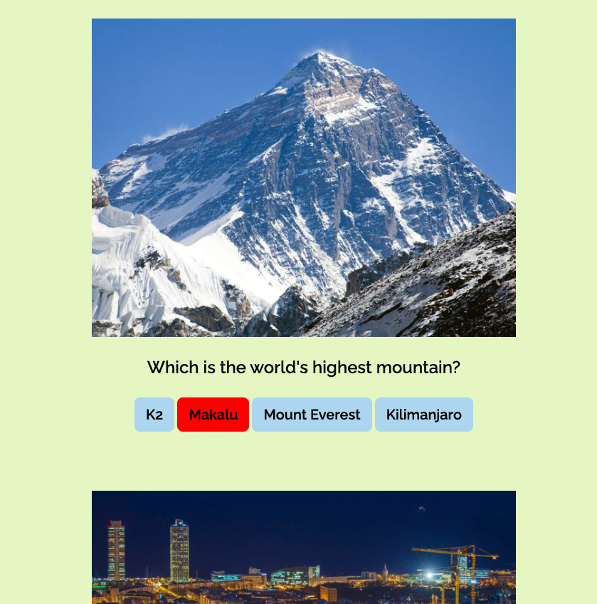

# Quiz

- This project was created as part of a coding bootcamp.
- We received a database with questions, images, possible answers and the correct answers.
- the planning of the project took place in group work with other participants
- We have created a PAP flowchart for this purpose
- The task: insert all elements into HTML via Javascript and develop a code that turns the button red or green, depending on whether the user's answer is correct or incorrect
- I mainly used for loops, conditions and innerHTML

## Demo

## Screenshots

## Tech Stack

- HTML5
- SCSS
- JavaScript
- miro/ PAP

## Author

- [@cecilestaller](https://github.com/cecilestaller)
